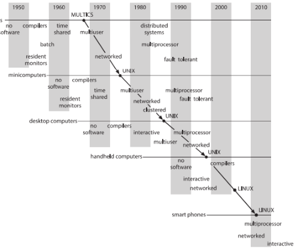
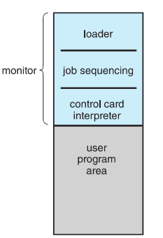
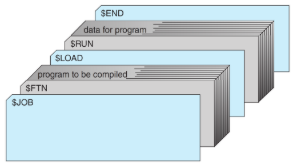
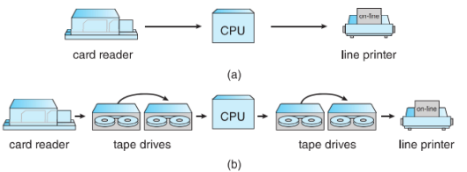
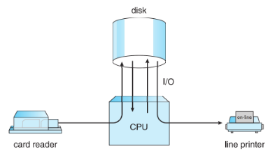

**SISTEM OPERASI**

**MERANGKUM APPENDIX-A**

Nama			: Erick Haidar Rahmat

NRP			: 3124500047

Dosen Pengajar	: Dr Ferry Astika Saputra ST, M.Sc

**PROGRAM STUDI D3 TEKNIK INFORMATIKA**

**POLITEKNIK ELEKTRONIKA NEGERI SURABAYA (PENS)**

**TANHUN 2025**

**INFLUENTAL OPERATING SYSTEMS**

Introduces a discussion on several older yet influential operating systems, including unique systems like XDS-940 and THE system, as well as widely used ones like OS/360. It emphasizes comparing their similarities and differences rather than following a chronological or importance-based order. Understanding these systems is essential for serious operating system students. Bibliographical notes at the chapter’s end provide references for further reading, including original papers by system designers, valued for both technical insights and writing style.

1. **Feature Migration**

   Studying early architectures and operating systems is valuable because features initially designed for large systems often migrate to smaller ones. Many mainframe features have been adopted in microcomputers, demonstrating that core operating system concepts apply across different computer classes, from mainframes to handheld devices. Understanding modern operating systems requires recognizing this feature migration and the long history behind many OS functionalities. An example of this is the MULTICS operating system, which played a key role in this evolution.

   

   MULTICS was developed at MIT (1965–1970) as a computing utility for the GE-645 mainframe. Many of its concepts influenced the creation of UNIX at Bell Labs around 1970 for the PDP-11 minicomputer. By the 1980s, UNIX features became foundational for UNIX-like microcomputer operating systems, including Microsoft Windows, Windows XP, and macOS. Linux adopted many of these features, which later extended to PDAs and other small devices.

1. **Early Systems**

   The history of computing predates modern computers, beginning with looms and calculators. However, the development of general-purpose computers emerged in the 1940s with Alan Turing and John von Neumann's concept of stored-program computers, which separated program and data storage. This idea led to the creation of early general-purpose machines, including the Manchester Mark 1 (1949) and the first commercial computer, the Ferranti Mark 1 (1951).

   Early computers were massive and operated manually from consoles. Programmers loaded programs using switches, paper tape, or punched cards, then executed them via console controls. They monitored execution through display lights and manually debugged errors. Output was printed or stored on paper tape or cards for later use.

1. **Dedicated Computer Systems**

   Over time, advancements in software and hardware introduced card readers, line printers, and magnetic tape. Assemblers, loaders, and linkers simplified programming, while function libraries enabled software reusability. I/O routines became crucial, requiring specialized device drivers to handle different hardware components. These drivers managed device-specific operations, preventing programmers from rewriting code for each device.

   The introduction of compilers like FORTRAN and COBOL further simplified programming but made computer operation more complex. Running a FORTRAN program involved multiple steps: loading the compiler from magnetic tape, reading and compiling the program, assembling the output, linking library routines, and finally executing and debugging the binary program from the console.

   Running a job required multiple steps, including loading and unloading tapes, compiling, assembling, and executing programs. Errors could force the programmer to restart from the beginning. Job setup was time-consuming, often leaving the CPU idle while handling tapes and punch cards. Given the high cost of early computers, maximizing utilization was crucial to justify their expense and optimize efficiency.

1. **Shared Computer Systems**

   To reduce setup time, two solutions were implemented. First, professional computer operators replaced programmers in running jobs, allowing for faster setup and continuous job execution. Debugging, however, became harder as programmers had to analyze memory dumps instead of debugging at the console.

   Second, jobs with similar requirements were batched together to minimize repetitive setup. For example, running multiple FORTRAN jobs sequentially reduced the need to reload the compiler, improving efficiency.

   

   Early batch processing systems faced inefficiencies when transitioning between jobs, causing CPU idle time. To address this, automatic job sequencing was developed, leading to the first rudimentary operating systems. A resident monitor, always present in memory, automated job execution by transferring control between programs.

   Control cards were introduced to instruct the resident monitor on which programs to run. Commands like $FTN, $ASM, and $RUN specified tasks, while $JOB and $END marked job boundaries. These cards helped automate job sequencing and track resource usage.

The resident monitor consisted of key components:

1. Control-card interpreter: Reads and executes control card instructions.
1. Loader: Loads system and application programs into memory.
1. Device drivers: Handle I/O operations for system and application programs.

This system improved efficiency by reducing manual intervention and automating job execution, ensuring better CPU utilization.

Batch systems with automatic job sequencing improved efficiency by reducing human intervention in job execution. The resident monitor continuously processed control cards, loading and running programs sequentially without manual setup.

However, CPU idle time remained an issue due to the slow speed of mechanical I/O devices compared to the CPU. While CPUs operated in the microsecond range, even the fastest card readers could only process about 20 cards per second, creating a significant speed gap. Although technology advancements improved I/O speeds, CPU performance increased even faster, exacerbating the imbalance between processing and I/O operations.

1. **Overlapped I/O**

   To address slow I/O speeds, batch systems in the late 1950s and early 1960s replaced card readers and line printers with magnetic-tape units. Instead of reading directly from cards, data was first copied onto magnetic tape using a separate device. Once full, the tape was transferred to the computer for processing, and output was similarly written to tape before being printed later.

   This off-line operation reduced the CPU's dependence on slow mechanical devices, allowing it to operate at the faster speed of magnetic tape units, significantly improving efficiency.

   

   Off-line operation improved efficiency by allowing multiple input and output devices (e.g., card readers, printers) to work simultaneously, ensuring the CPU remained busy. However, this method introduced delays, as jobs had to be read onto tape, stored, transported, and mounted before execution.

   Disk systems soon replaced tape-based off-line processing due to their random-access capability, allowing simultaneous reading and writing. This led to the development of spooling (Simultaneous Peripheral Operation On-Line), where disks acted as large buffers, enabling faster input processing and delayed output handling. Spooling significantly improved system performance by optimizing CPU and I/O device usage.

   

   Spooling is also used for remote data processing, where the CPU sends data to remote devices without direct intervention, only requiring notification upon completion. It enables overlapping I/O and computation, allowing multiple jobs to be processed simultaneously—one job’s input can be read while another's output is printed, and yet another is executed.

   This improves system performance by efficiently utilizing both the CPU and I/O devices with minimal additional cost. Spooling naturally leads to multiprogramming, a key concept in modern operating systems, allowing multiple tasks to run concurrently.

1. **Atlas**

   The Atlas operating system, developed at the University of Manchester in the late 1950s and early 1960s, introduced several innovative features that later became standard in modern OS design. It was a batch operating system with spooling for efficient job scheduling and included device drivers and system calls via special instructions called extra codes.

   Its most remarkable feature was memory management. Since core memory was expensive, Atlas used a drum for primary memory and a small amount of core memory as a cache. It implemented demand paging to manage memory between the drum and core automatically. The system used a 48-bit British computer with a large address space of 1 million words, with memory divided into 512-word pages and mapped via associative memory.

   Atlas introduced an advanced page-replacement algorithm based on predicting future memory access. It analyzed reference bits from past accesses to determine which pages to replace. The algorithm assumed that memory access patterns followed loops, replacing pages predicted to be least needed. This approach significantly improved memory efficiency and laid the foundation for modern virtual memory systems.

1. **XDS-940**

   The XDS-940 operating system, developed at UC Berkeley in the early 1960s, was a time-sharing system that used paging for memory relocation but not for demand paging. It allocated 16-KB virtual memory per user process within a 64-KB physical memory, with 2-KB pages stored in registers. Multiple processes could run simultaneously, and page sharing allowed more users by using read-only reentrant code. Processes were stored on a drum and swapped in and out as needed.

   Built from a modified XDS-930, the system introduced a user-monitor mode and privileged instructions like I/O and halt, which would trigger an OS trap if executed in user mode. A system-call instruction allowed resource creation and management, such as file allocation using a bitmap and index blocks.

   The XDS-940 also supported process management through system calls for creating, starting, suspending, and destroying subprocesses. Processes were structured in a tree hierarchy, enabling communication and synchronization via shared memory, laying the foundation for modern multitasking and process control.

1. **THE**

   The THE operating system, developed at Technische Hogeschool Eindhoven in the mid-1960s, was a batch system running on the Dutch EL X8 computer. It was notable for its layered design and use of concurrent processes synchronized with semaphores. Unlike the dynamic processes in XDS-940, THE had a static set of processes, including five user processes that compiled, executed, and printed programs.

   The system used a priority-based CPU scheduling algorithm, where priorities were recalculated every two seconds, favoring I/O-bound and new processes. Due to limited hardware support, memory management relied on a software paging scheme, with an LRU page-replacement strategy and a 512-KB drum as backing storage. Programs were written in Algol, and the compiler automatically managed memory access and swapping.

   To prevent deadlocks, THE implemented the banker's algorithm for deadlock avoidance. A related system, Venus, followed a similar layered structure but used microcode for faster execution, paged-segmented memory for management, and was designed as a time-sharing rather than a batch system.

1. **RC 4000**

   The RC 4000 system, developed in the late 1960s for the Danish 4000 computer by Regnecentralen and Brinch-Hansen, was notable for its kernel-based design. Unlike traditional batch or time-sharing systems, RC 4000 focused on creating a flexible operating-system nucleus that could be adapted for various system types.

   The kernel supported concurrent processes and used a round-robin CPU scheduler. Processes primarily communicated through a message system, exchanging fixed-size messages (8 words) stored in a common buffer pool. Messages were managed using FIFO-based queues, and primitive operations such as send-message, wait-message, send-answer, and wait-answer were provided for synchronization. Additional operations like wait-event and get-event allowed more flexible message handling.

   I/O devices were treated as processes, with device drivers converting interrupts and registers into messages. This design enabled seamless process communication, as processes could interact with devices by sending and receiving messages, making RC 4000 a foundational system for modern microkernel architectures.

1. **CTSS**

   The Compatible Time-Sharing System (CTSS), developed at MIT in 1961, was an experimental time-sharing system implemented on the IBM 7090, supporting up to 32 interactive users. It allowed users to manipulate files, compile, and run programs via a terminal.

   CTSS had 32-KB memory, with 5 KB reserved for the monitor and 27 KB for users. User memory was swapped between RAM and a fast drum. It used a multilevel-feedback-queue CPU scheduling algorithm, where time quanta doubled at lower levels, prioritizing shorter jobs while ensuring longer ones received enough CPU time.

   CTSS was highly successful, remaining in use until 1972. It proved that time-sharing was practical, leading to further time-sharing system development and influencing the creation of MULTICS.

1. **Multics**

   The MULTICS operating system, developed from 1965 to 1970 at MIT, was an advanced time-sharing system designed as a successor to CTSS. It aimed to provide computing as a utility, connecting large computers to remote terminals via telephone lines for continuous operation with a vast shared file system.

   MULTICS was developed by MIT, GE, and Bell Labs (which withdrew in 1969). The GE 635 computer was modified into the GE 645, adding paged-segmentation memory. Virtual addresses used an 18-bit segment number and a 16-bit word offset, with 1-KB pages and a second-chance page-replacement algorithm.

   The file system was structured as a multilevel tree, integrating segmented virtual memory, where each segment functioned as a file. It featured multilevel feedback queue CPU scheduling and protection mechanisms like access lists and protection rings.

   MULTICS, written mostly in PL/1 (300,000 lines of code), later supported multiprocessing, allowing CPUs to be serviced without shutting down the system. It significantly influenced modern operating systems, including UNIX.

1. **IBM OS/360**

   The longest-running operating system lineage belongs to IBM. Early IBM systems like the 7090 and 7094 introduced key OS concepts such as I/O subroutines, resident monitors, and batch processing, but these systems were developed independently, creating software incompatibilities.

   To unify its product line, IBM introduced the IBM/360 in the mid-1960s, designed to run a single operating system, OS/360, across various machine sizes. However, OS/360 struggled to meet diverse user needs, leading to issues with file system complexity, rigid memory management, and high overhead costs. Two versions emerged: OS/MFT (fixed memory regions) and OS/MVT (variable regions).

   With the IBM/370 architecture, virtual memory was introduced. OS/VS1 and OS/VS2 adapted OS/360 to virtual memory, with OS/VS2 evolving into MVS, which remains a batch-processing system. IBM attempted time-sharing with TSS/360, but delays and performance issues led to its failure. Instead, IBM developed TSO (for MVS) and CP/67 (for CMS), which became the foundation of VM.

   Both TSS/360 and MULTICS failed commercially due to their complexity, size, and reliance on centralized computing. The rise of minicomputers, workstations, and later personal computers reduced the demand for large monolithic systems, shifting computing power closer to end users.

1. **TOPS-20**

   DEC developed several influential operating systems, with VMS (now OpenVMS under Hewlett-Packard) being widely used in business. However, TOPS-20 was arguably its most impactful system.

   TOPS-20 originated as TENEX, a time-sharing OS developed by BBN around 1970 for the DEC PDP-10. TENEX introduced virtual memory by adding a hardware paging system. DEC acquired TENEX, integrated a built-in hardware pager into a new machine (DECSYSTEM-20), and released it as TOPS-20.

   TOPS-20 featured an advanced command-line interpreter with user assistance, combined with powerful hardware at a reasonable price, making the DECSYSTEM-20 the leading time-sharing system of its era. However, in 1984, DEC discontinued its 36-bit PDP-10 line to focus on 32-bit VAX systems running VMS.

1. **CP/M and MS/DOS**

   Early hobbyist computers in the 1970s were kit-based and ran a single program at a time. As technology advanced, CP/M (Control Program/Monitor) emerged as a standard OS, developed by Gary Kildall of Digital Research, Inc. for the 8-bit Intel 8080 CPU. It was a text-based system with a command interpreter similar to TOPS-10 and initially supported only 64 KB of memory.

   When IBM entered the personal computer market, it commissioned Bill Gates and Microsoft to develop MS-DOS for the 16-bit Intel 8086. MS-DOS was heavily inspired by CP/M but included a richer set of commands, influenced by TOPS-10. Launched in 1981, MS-DOS became the dominant personal computer OS, evolving until 2000. It supported 640 KB of memory and allowed limited access to extended and expanded memory but lacked key modern OS features like protected memory.

1. **Macintosh Operating System and Windows**

   With the rise of 16-bit CPUs, personal computer operating systems became more advanced and user-friendly. The Apple Macintosh (launched in 1984) was one of the first GUI-based home computers, featuring a mouse-driven interface and built-in utilities. Due to high hard-disk costs, it initially relied on a 400-KB floppy drive.

   Apple’s Mac OS was eventually overshadowed by Microsoft Windows (launched in 1985), which was licensed to multiple hardware manufacturers. As CPUs evolved to 32-bit, features like protected memory and context switching—once exclusive to mainframes and minicomputers—became standard in personal computers. This led to the decline of minicomputers, which were replaced by servers with greater memory, storage, and processing power, typically housed in data centers.

   The Apple vs. Microsoft desktop rivalry continues, with each OS competing in features, usability, and applications. Other systems like AmigaOS and OS/2 failed to sustain competition. Meanwhile, Linux has grown in popularity among technical users and has reached nontechnical audiences through projects like One Laptop per Child (OLPC).

1. **Mach**

   The Mach operating system, developed at Carnegie Mellon University (CMU) in the 1980s, evolved from the Accent OS and was designed with three key goals:

1. BSD UNIX compatibility, allowing UNIX executables to run on Mach.
1. Modern architecture support, including parallel and distributed computing.
1. A simplified and modular kernel, making it easier to modify than 4.3 BSD.

Mach initially integrated with BSD UNIX, replacing its components gradually. By Mach 3, it adopted a microkernel design, moving UNIX-specific functions to user-mode servers, allowing multiple OS interfaces to run on top of the kernel. This approach paralleled virtual machines but was defined by software rather than hardware.

Multiprocessing was central to Mach, with lightweight threads, message-based communication, and a flexible architecture supporting shared-memory and distributed systems. Mach’s message system integrated with virtual memory, ensuring efficient interprocess communication.

Mach gained prominence when the Open Software Foundation (OSF) selected Mach 2.5 as the basis for OSF/1 in 1989. It also powered NeXTSTEP, later acquired by Apple, forming the foundation of macOS and iOS through XNU, a hybrid Mach-BSD kernel. While GNU Hurd remains the last pure Mach implementation, Mach continues to evolve within Apple's ecosystem.

1. **Capability Based Systems Hydra and Cap**

   In this section, we survey two capability based systems. These systems differ in their complexity and in the types of policies that can be implemented on them. Neither systems is widely used, but both provide interesting proving grounds for protection theories.

   **Hydra**

   The Hydra operating system is a capability-based protection system that provides flexible access control. It defines a fixed set of system-defined access rights (e.g., read, write, execute) and allows user-defined rights, which are interpreted by user programs while being protected by the system. Hydra uses procedural object operations, where operations are accessed indirectly through capabilities. Each object has auxiliary rights that define allowed operations, ensuring fine-grained access control on an instance-by-instance and process-by-process basis.

   A key feature is rights amplification, allowing trusted procedures to temporarily gain elevated access to an object while performing specific tasks. Amplification enables controlled access to an object’s internal representation while ensuring that access rights are restored once the operation is complete, maintaining system integrity. Hydra also addresses mutually suspicious subsystems, where programs may access user data without permission or be at risk of modification. It enforces access control through kernel-defined primitives, allowing subsystems to define their own security policies while relying on Hydra’s capability-based protection system.

   Programmers can utilize Hydra’s extensive system-defined procedure library through direct calls or integrated program translators, ensuring secure and controlled execution of user-defined processes.

   **CAP Systems**

   The Cambridge CAP system offers a simpler but still effective capability-based protection model compared to Hydra. It defines two types of capabilities:

1. Data Capabilities – Interpreted by the CAP machine’s microcode, they provide standard read, write, and execute access to storage segments.
1. Software Capabilities – Protected but not interpreted by microcode, they are processed by privileged procedures written by application developers.

A unique feature of CAP is its rights amplification mechanism, which allows protected procedures to temporarily access and modify software capabilities. This resembles the seal and unseal primitives used in some security models, ensuring controlled access while maintaining type verification and restricting trust to the microcode level.

Unlike Hydra, CAP gives subsystems full control over how software capabilities are interpreted. This flexibility enables various protection policies, but subsystem designers must understand protection principles rather than relying on predefined libraries. While insecure protected procedures may compromise a subsystem, the system's core security remains intact, preventing unauthorized access beyond a subsystem’s protection domain.

1. **Other Systems**

   There are, of course, other operating systems, and most of them have interesting properties. The MCP operating systems for the Burroughs computer family was the first to be written in a system programming language. It supported sengmentation and multiple CPU’s. The SCOPE operating system for the CDC 6600 was also a multi CPU system. The coordination and synchronization of the multiple processes were surprisingly well designed.

   History is littered with operating systems that suited a purpose for a time(be it a long or a short time) and then, when faded, were replaced by operating systems that had more features, supported newer hardware, were easier to use, or were better marketed. We are sure this trend will continue in the future.

