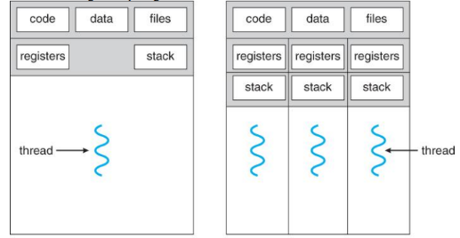
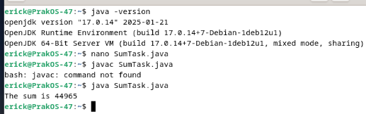
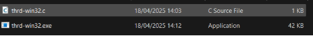
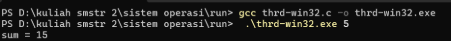

**LAPORAN SISTEM OPERASI**

**TUGAS CHAPTER 4**
**

Nama			: Erick Haidar Rahmat

NRP			: 3124500047

Dosen Pengajar	: Dr Ferry Astika Saputra ST, M.Sc

**PROGRAM STUDI D3 TEKNIK INFORMATIKA**

**POLITEKNIK ELEKTRONIKA NEGERI SURABAYA (PENS)**

**TANHUN 2025**

1. **Tugas** 
1. Jelaskan dalam 2 paragraph disertai dengan gambar tentang konsep single thread dan multithread!
1. Kerjakan programming exercise
1. Penerapamn thread pada contoh Sumtask.java
1. Penerapan Thread di Linux (thrd-posix.c) dan penerapan thread di Microsoft Widows (thrd-win32.c). Beri penjelasan dalam bentuk essay. Gunakan link berikut <https://github.com/ferryastika/osc10e/tree/master/ch4>.
1. Buat PPT tentang evolusi teknologi processor intel dengan menggunakan referensi : <https://www.youtube.com/watch?v=PT787d9odKk> 
1. Jawab pertanyaan exercise pada chapter 4! Semua pekerjaan dilaporkan dalam bentuk tulisan di github anda masing masing. Pengumpulan di ethol hanya link repo saja!

1. **Jawaban dan Solusi**
1. Single thread adalah model pemrosesan di mana hanya satu jalur eksekusi yang berjalan dalam suatu waktu. Dalam program single thread, setiap tugas dijalankan secara berurutan, satu setelah yang lain. Hal ini membuatnya mudah diimplementasikan dan di-debug, karena alurnya linier dan tidak kompleks. Namun, kekurangan dari pendekatan ini adalah tidak mampu memanfaatkan kemampuan prosesor modern yang memiliki banyak inti (core), sehingga dapat menyebabkan program menjadi lambat ketika menangani tugas-tugas berat atau banyak proses input/output.

   Multithread adalah model pemrosesan yang memungkinkan beberapa thread berjalan secara bersamaan dalam satu proses. Masing-masing thread bisa mengerjakan tugas yang berbeda pada waktu yang sama, sehingga meningkatkan efisiensi dan kinerja, khususnya pada sistem dengan banyak inti prosesor. Penggunaan multithreading sangat bermanfaat pada aplikasi yang membutuhkan banyak proses paralel, seperti server, game, dan aplikasi real-time lainnya. Walaupun lebih efisien, penggunaan multithread memerlukan manajemen sinkronisasi agar thread-thread tersebut tidak saling mengganggu saat mengakses data yang sama.

   Gambar tentang komsep single thread dan multithread :

   

`  	               `Single-thread process	               Multithreaded process

1. Kerjakan Programing exercise
1. Penerapamn thread pada contoh Sumtask.java

   

   1\. Cek dengan java -version jika tidak ada maka.

   2\. sudo apt-get update.

   3\. sudo apt-cache search openjdk.

   4\. sudo apt-get install openjdk-17-jdk # Jika tersedia versi 17.

   5\. jika sudah terinstall maka cek kembali dengan java -version.

   6\. buat file SumTask.java menggunakan nano.

   7\. kemudian isi file menggunakan code yang ada pada github : https://github.com/ferryastika/osc10e/blob/master/ch4/SumTask.java

   8\. setelah diisikan kompilasikan file menggunakan javac SumTask.java.

   9\. lalu jalankan menggunakan java SumTask.

   10\.mengapa 3x percobaan menghasilkan hasil yang berbeda? Karena perbedaan hasil wajar terjadi karena program dirancang untuk menggunakan data acak.

1. penerapan Thread di Linux (thrd-posix.c)

   

   Untuk langkah langkah nya :

   1\. cek terlebih dahulu gcc –version jika sudah terinstal maka,

   2\. buat file thrd-posix.c menggunakan nano lalu isikan file dari code

   github : https://github.com/ferryastika/osc10e/blob/master/ch4/thrdposix.c

   3\. gunakan gcc -pthread thrd-posix.c -o thrd-posix untuk mengkompilasi

   program C yang menggunakan posix threads.

   4\. kemudian jalankan program dengan ./thrd-posix ( angka pilihan )

   contoh saya ./thrd-posix 5.

1. penerapan thread di Microsoft Windows (thrd-win32.c).

   

   

   Untuk langkah langkahnya :

   1\. buat file thrd-win32.c lalu isikan code dari github :

   https://github.com/ferryastika/osc10e/blob/master/ch4/thrd-win32.c

   2\. kemudian kompilasi program dengan gcc thrd-win32.c -o thrdwin32.exe.

   3\. kemudian jalankan dengan menggunakan .\thrd-win32.exe ( angka

   pillihan ), pada gambar saya menggunakan .\thrd-win32.exe 5.

   Penjelasan dari sumtask.java:

1. Program SumTask adalah contoh implementasi teknik pemrograman paralel di Java menggunakan Fork/Join Framework. Tujuan utama dari program ini adalah menjumlahkan elemen-elemen dalam sebuah array besar secara efisien dengan cara membagi tugas menjadi bagian-bagian yang lebih kecil, lalu menjalankannya secara bersamaan. Dalam konteks ini, pendekatan paralel digunakan untuk meningkatkan kinerja ketika berhadapan dengan data yang besar.

   Program dimulai dengan mendefinisikan ukuran array (SIZE) sebanyak 10.000 elemen dan ambang batas tugas (THRESHOLD) sebesar 1000. Ketika program dijalankan, array tersebut akan diisi dengan angka acak antara 0 sampai 9 menggunakan objek Random. Setelah array diisi, proses penjumlahan dilakukan menggunakan kelas SumTask, yang merupakan subclass dari RecursiveTask<Integer>. Kelas ini digunakan untuk mendefinisikan tugas-tugas yang dapat dikerjakan secara paralel dan mengembalikan hasil bertipe Integer.

   Metode utama dalam SumTask adalah compute(). Jika selisih antara indeks begin dan end lebih kecil dari nilai ambang (THRESHOLD), maka tugas langsung dikerjakan dengan menjumlahkan elemen array satu per satu. Namun, jika lebih besar dari ambang, maka tugas akan dibagi dua: satu untuk bagian kiri array (leftTask) dan satu lagi untuk bagian kanan array (rightTask). Kedua tugas ini dijalankan secara paralel menggunakan metode fork(), lalu digabungkan hasilnya dengan join().

   Di dalam metode main(), objek ForkJoinPool digunakan untuk menjalankan tugas utama. Objek SumTask dibuat dengan rentang penuh dari array, lalu dijalankan melalui metode invoke(). Hasil akhir penjumlahan seluruh elemen array kemudian dicetak ke layar.

   Output yang dihasilkan oleh program ini, seperti yang terlihat pada tangkapan layar, adalah “The sum is 44965”. Ini menunjukkan bahwa array berhasil dijumlahkan, meskipun terdapat kendala saat mencoba menjalankan perintah javac karena perintah tersebut tidak ditemukan. Hal ini bisa terjadi karena hanya interpreter java yang terinstal di sistem, tanpa compiler javac.

   Secara keseluruhan, program SumTask mencerminkan konsep penting dalam pemrograman modern, yaitu bagaimana memanfaatkan paralelisme untuk menyelesaikan masalah komputasi dengan lebih cepat. Program ini juga menunjukkan bagaimana pendekatan divide and conquer dapat diimplementasikan dengan elegan menggunakan fitur Fork/Join yang disediakan oleh Java. Pendekatan ini sangat relevan dalam era komputasi multi-core saat ini, di mana pemanfaatan banyak inti prosesor menjadi kunci utama dalam meningkatkan performa aplikasi. Program SumTask tidak hanya mengajarkan dasar-dasar pemrograman paralel, tetapi juga membentuk pola pikir yang efisien dan terstruktur dalam menyelesaikan masalah komputasi skala besar.

1. Program di atas merupakan contoh implementasi pemrograman paralel menggunakan POSIX Threads (pthreads) dalam bahasa pemrograman C. Program ini memiliki tujuan utama untuk menghitung jumlah total dari bilangan bulat mulai dari 1 hingga nilai yang diberikan sebagai argumen saat menjalankan program. Pendekatan yang digunakan melibatkan pembuatan sebuah thread terpisah yang akan menangani proses perhitungan, sementara thread utama hanya bertugas membuat thread tersebut dan menunggu hingga selesai.

   Program dimulai dengan deklarasi variabel global sum, yang akan menyimpan hasil akhir dari perhitungan jumlah bilangan. Selanjutnya, fungsi utama main() menerima satu argumen, yaitu bilangan bulat yang akan dijadikan batas atas dari perhitungan. Jika argumen tidak sesuai, program akan menampilkan pesan kesalahan. Jika argumen valid, program melanjutkan dengan menginisialisasi atribut thread (pthread\_attr\_t) menggunakan pthread\_attr\_init, lalu membuat thread baru dengan pthread\_create(). Thread tersebut akan menjalankan fungsi runner, yang berisi logika perhitungan jumlah.

   Fungsi runner() akan mengonversi parameter input menjadi integer, lalu menjumlahkan semua bilangan dari 1 hingga nilai tersebut menggunakan loop. Hasilnya disimpan di variabel sum yang bersifat global dan dapat diakses oleh thread utama setelah thread runner selesai dieksekusi. Setelah thread selesai, program kembali ke thread utama yang kemudian mencetak hasil penjumlahan ke layar.

   Dari segi pembelajaran, program ini memberikan pemahaman dasar tentang bagaimana sebuah proses dapat dibagi menjadi beberapa unit kerja yang lebih kecil melalui penggunaan thread. Meskipun dalam contoh ini hanya digunakan satu thread tambahan, konsep ini tetap relevan untuk memahami bagaimana pemrograman paralel bekerja. Thread memungkinkan proses berjalan secara konkuren, yang pada sistem dengan lebih dari satu inti prosesor dapat memberikan peningkatan performa.

   Namun, dalam implementasi ini, penggunaan thread mungkin tampak berlebihan karena hanya satu thread tambahan digunakan dan tugasnya cukup sederhana. Akan tetapi, contoh ini sangat berguna untuk tujuan edukasi karena memperkenalkan konsep dasar thread, atribut thread, pembuatan dan penggabungan thread (pthread\_create dan pthread\_join), serta penanganan data yang dibagikan antar-thread.

   Kesimpulannya, program sumtask versi C ini menunjukkan bagaimana kitabisa menggunakan thread untuk melakukan tugas sederhana seperti menjumlahkan angka dalam rentang tertentu. Meski belum mengoptimalkan paralelisme sepenuhnya, contoh ini menjadi langkah awal yang penting untuk memahami dasar-dasar pemrograman multithreaded dalam bahasa C. Dengan pemahaman ini, mahasiswa atau pengembang dapat mengembangkan aplikasi yang lebih kompleks dengan memanfaatkan kemampuan komputasi paralel secara lebih maksimal.

1. Program di atas adalah implementasi dari konsep thread atau utas dalam pemrograman C menggunakan pustaka pthread.h. Program ini dirancang untuk menghitung jumlah bilangan bulat dari 1 hingga nilai yang diberikan oleh pengguna sebagai argumen saat menjalankan program. Hasil akhir dari program ini berupa nilai total yang ditampilkan di layar, misalnya saat pengguna memasukkan angka 5, maka hasilnya adalah 15, karena 1+2+3+4+5 = 15.

   Dalam program ini, terdapat variabel global sum yang digunakan untuk menyimpan hasil penjumlahan. Fungsi main() akan terlebih dahulu memeriksa apakah pengguna telah memberikan argumen dengan benar, yakni satu buah bilangan bulat yang tidak negatif. Jika argumen tidak sesuai, program akan menampilkan pesan kesalahan dan keluar. Setelah validasi berhasil, program menginisialisasi atribut thread, lalu membuat sebuah thread menggunakan fungsi pthread\_create() yang menjalankan fungsi runner().

   Fungsi runner() adalah tempat di mana proses penjumlahan dilakukan. Ia mengonversi argumen yang diberikan ke bentuk integer, lalu menggunakan perulangan untuk menjumlahkan seluruh bilangan dari 1 hingga nilai tersebut. Setelah selesai, thread akan keluar dengan pthread\_exit(0) dan thread utama melanjutkan ke baris berikutnya, yaitu pthread\_join() yang akan menunggu thread runner() selesai sebelum mencetak hasil sum ke layar.

   Penerapan program ini sangat relevan dalam mata kuliah Sistem Operasi, karena menggambarkan bagaimana proses dapat dibagi menjadi beberapa thread yang berjalan secara paralel atau asinkron. Meskipun dalam contoh ini hanya ada satu thread tambahan, konsep ini menjadi pondasi dalam memahami bagaimana sistem operasi mengelola multitasking, sinkronisasi data antar-thread, dan penggunaan sumber daya bersama.

   Dari sisi pengembangan program, pendekatan ini juga memberikan wawasan penting mengenai pentingnya pengelolaan thread, serta bagaimana penggunaan variabel global yang dapat diakses oleh banyak thread harus dikendalikan dengan baik agar tidak terjadi race condition. Meskipun program ini cukup sederhana dan belum menunjukkan efek nyata dari paralelisme, implementasi seperti ini sangat bermanfaat sebagai pengantar ke dunia pemrograman multithreaded yang lebih kompleks.

1. Membuat ppt terkait evolusi processor intel :

   https://drive.google.com/file/d/19naUBl4kVCSxxAdttVizFEOruxSesAFt/view?usp=drive\_link

1. Menjawab exercise :
   1. Provide three programming examples in which multithreading provides better performance than a single-threaded solution. Answer :

      Web Servers – Multithreaded web servers can handle multiple client requests simultaneously, reducing response time.

      Video Processing – Processing different frames or applying filters concurrently improves rendering speed.

      Gaming Engines – One thread handles graphics rendering, another for physics calculation, and others for input or AI, allowing smoother performance.

   1. Using Amdahl’s Law, calculate the speedup gain of an application that has a 60 percent parallel component for (a) two processing cores and (b) four processing cores. Answer :

      

      Where :

      -p =0.6 (60% parallel)

      -N = number of cores	

      (a) for 2 cores :

      

      (b) for 4 cores :

      

   1. Does the multithreaded web server described in Section 4.1 exhibit task or data parallelism? Answer :

      It exhibits task parallelism, as each thread performs a different task (serving a different client), not the same task on different data.

   1. What are two differences between user-level threads and kernel-level threads? Under what circumstances is one type better than the other? Answer :
- User-level threads are managed by user-space libraries, while kernel-level threads are managed by the OS.
- User threads are faster to create and manage, but if one blocks, all might block. Kernel threads can be scheduled independently by the OS.

User threads are better when performance and quick switching are needed.

Kernel threads are better when true parallel execution on multiple cores is required.

1. Describe the actions taken by a kernel to context-switch between kernel-level threads. Answer :
- Save the state (registers, program counter, etc.) of the current thread.
- Choose a new thread to run.
- Load the state of the new thread.
- Update memory management if needed.
- Resume execution of the new thread.

1. What resources are used when a thread is created? How do they differ from those used when a process is created? Answer :

   When a thread is created:

- Requires stack space, thread control block, and registers.
- Shares code, data, and open files with other threads.

When a process is created:

- Requires separate memory space, code, data, and resources.
- Threads are more lightweight and use fewer resources than processes.

1. Is it necessary to bind a real-time thread to an LWP? Explain. Answer :

   Yes, binding a real-time thread to a Lightweight Process (LWP) ensures that the thread has direct kernel scheduling and access to CPU resources, which is crucial for meeting strict timing constraints in real-time systems. Without binding, scheduling delays may occur, compromising real-time guarantees.

