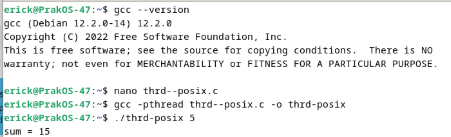
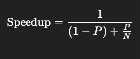

# LAPORAN SISTEM OPERASI  
## TUGAS CHAPTER 4  

**Nama:**  
**NRP:**  
**Dosen Pengajar:** Dr. Ferry Astika Saputra, ST., M.Sc  
**NIDN:** 3124500047  

**PROGRAM STUDI D3 TEKNIK INFORMATIKA**  
**POLITEKNIK ELEKTRONIKA NEGERI SURABAYA (PENS)**  
**TAHUN 2025**  

---

## A. Tugas  

1. Jelaskan dalam 2 paragraf disertai dengan gambar tentang konsep single thread dan multithread!  
2. Kerjakan programming exercise:  
   - a. Penerapan thread pada contoh `SumTask.java`  
   - b. Penerapan thread di Linux (`thrd-posix.c`) dan penerapan thread di Microsoft Windows (`thrd-win32.c`). Beri penjelasan dalam bentuk esai. Gunakan link berikut: https://github.com/ferryastika/osc10e/tree/master/ch4  
3. Buat PPT tentang evolusi teknologi processor Intel dengan menggunakan referensi:  
   https://www.youtube.com/watch?v=PT787d9odKk  
4. Jawab pertanyaan exercise pada Chapter 4!  
   > Semua pekerjaan dilaporkan dalam bentuk tulisan di GitHub Anda masing-masing. Pengumpulan di Ethol hanya link repo saja!  

---

## B. Jawaban dan Solusi  

### 1. Penjelasan Konsep Single Thread dan Multithread  

Single thread adalah model pemrosesan di mana hanya satu jalur eksekusi yang berjalan dalam suatu waktu. Dalam program single thread, setiap tugas dijalankan secara berurutan, satu setelah yang lain. Hal ini membuatnya mudah diimplementasikan dan di-debug, karena alurnya linier dan tidak kompleks. Namun, kekurangan dari pendekatan ini adalah tidak mampu memanfaatkan kemampuan prosesor modern yang memiliki banyak inti (core), sehingga dapat menyebabkan program menjadi lambat ketika menangani tugas-tugas berat atau banyak proses input/output.  

Multithread adalah model pemrosesan yang memungkinkan beberapa thread berjalan secara bersamaan dalam satu proses. Masing-masing thread bisa mengerjakan tugas yang berbeda pada waktu yang sama, sehingga meningkatkan efisiensi dan kinerja, khususnya pada sistem dengan banyak inti prosesor. Penggunaan multithreading sangat bermanfaat pada aplikasi yang membutuhkan banyak proses paralel, seperti server, game, dan aplikasi real-time lainnya. Walaupun lebih efisien, penggunaan multithread memerlukan manajemen sinkronisasi agar thread-thread tersebut tidak saling mengganggu saat mengakses data yang sama.  

**Gambar tentang konsep single thread dan multithread:**  

  

- *Single-thread process*  
- *Multithreaded process*  

---

### 2. Programming Exercise  

#### a. Penerapan Thread pada `SumTask.java`  

  
1. Cek dengan `java -version`  
2. Jalankan `sudo apt-get update`  
3. Cek versi Java yang tersedia dengan `sudo apt-cache search openjdk`  
4. Install dengan `sudo apt-get install openjdk-17-jdk` (jika tersedia versi 17)  
5. Cek kembali instalasi dengan `java -version`  
6. Buat file `SumTask.java` dengan `nano`  
7. Isi file dengan kode dari [SumTask.java](https://github.com/ferryastika/osc10e/blob/master/ch4/SumTask.java)  
8. Kompilasi dengan `javac SumTask.java`  
9. Jalankan dengan `java SumTask`  
10. Penjelasan: Tiga hasil percobaan dapat berbeda karena menggunakan data acak.  

#### b. Penerapan Thread di Linux (`thrd-posix.c`)  

 

1. Cek dengan `gcc --version`  
2. Buat file `thrd-posix.c` dan salin kode dari [thrd-posix.c](https://github.com/ferryastika/osc10e/blob/master/ch4/thrd-posix.c)  
3. Kompilasi dengan `gcc -pthread thrd-posix.c -o thrd-posix`  
4. Jalankan dengan `./thrd-posix <angka>` (contoh: `./thrd-posix 5`)  

#### c. Penerapan Thread di Microsoft Windows (`thrd-win32.c`)  

   

   

1. Buat file `thrd-win32.c` dan salin kode dari [thrd-win32.c](https://github.com/ferryastika/osc10e/blob/master/ch4/thrd-win32.c)  
2. Kompilasi dengan `gcc thrd-win32.c -o thrd-win32.exe`  
3. Jalankan dengan `.\thrd-win32.exe <angka>` (contoh: `.\thrd-win32.exe 5`)  

---

### Penjelasan Program  

#### a. `SumTask.java`  
Program ini menggunakan Fork/Join Framework di Java untuk menjumlahkan elemen array besar secara paralel. Array dengan 10.000 elemen diisi angka acak, lalu dibagi menjadi sub-tugas menggunakan class `SumTask`. Jika sub-array cukup kecil, ia dijumlahkan langsung, jika tidak maka dibagi dan dijalankan paralel dengan `fork()` dan `join()`. ForkJoinPool digunakan untuk mengeksekusi tugas utama.  

#### b. `thrd-posix.c`  
Menggunakan POSIX Threads (pthreads) dalam C, program ini menghitung jumlah dari 1 sampai `n`. Thread baru dibuat dengan `pthread_create()`, melakukan perhitungan di fungsi `runner()`, dan hasilnya dicetak oleh thread utama setelah `pthread_join()`. Konsep ini mendemonstrasikan dasar thread dalam C dan pemrosesan konkuren.  

#### c. `thrd-win32.c`  
Konsep yang digunakan sama seperti `thrd-posix.c` namun diimplementasikan untuk Windows. Menggunakan `pthread_create()` dan `pthread_join()`, proses paralel dilakukan untuk menjumlahkan bilangan hingga `n`. Meski sederhana, program ini memperkenalkan pentingnya manajemen thread dalam sistem operasi.  

---

### 3. PPT Evolusi Processor Intel  

Link: [PPT Evolusi Intel](https://drive.google.com/file/d/19naUBl4kVCSxxAdttVizFEOruxSesAFt/view?usp=drive_link)  

---

### 4. Jawaban Exercise  

**4.1**  
Contoh multithreading yang memberikan performa lebih baik:  
- Web Server  
- Video Processing  
- Game Engine  

**4.2**  
Menggunakan Amdahl’s Law  

 
- \( p = 0.6 \)  
- (a) 2 cores:  

 
  \( S = \frac{1}{(1 - p) + \frac{p}{N}} = \frac{1}{0.4 + \frac{0.6}{2}} = 1.43 \)  
- (b) 4 cores:  

  \( S = \frac{1}{0.4 + \frac{0.6}{4}} = 1.67 \)  

**4.3**  
Multithreaded web server menggunakan *task parallelism*.  

**4.4**  
Perbedaan User-level dan Kernel-level Threads:  
- User-level: dikelola oleh library pengguna, lebih cepat dibuat, tapi satu blocking bisa memblokir semua.  
- Kernel-level: dikelola OS, bisa dijadwalkan secara independen.  
- User-level cocok untuk performa tinggi, kernel-level untuk true parallelism.  

**4.5**  
Langkah context-switch oleh kernel:  
- Simpan status thread saat ini  
- Pilih thread baru  
- Muat status thread baru  
- Perbarui manajemen memori  
- Lanjutkan eksekusi thread baru  

**4.6**  
Sumber daya saat membuat thread:  
- Stack, control block, register, berbagi memory  
Saat membuat proses:  
- Memori terpisah, kode/data sendiri.  
- Thread lebih ringan daripada proses.  

**4.7**  
Ya, binding real-time thread ke LWP penting agar bisa dijadwalkan langsung oleh kernel dan menjamin respons waktu nyata.

---

